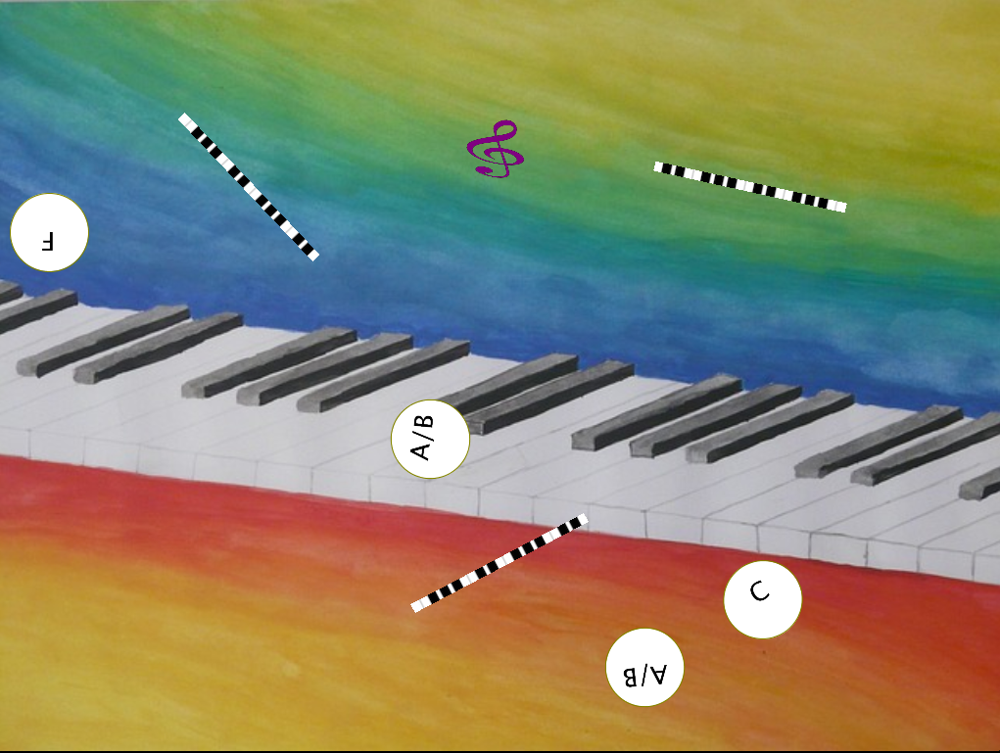
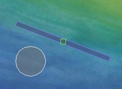

# ACDesktop

With this program I wanted to experiment with random note player using collisions to play a note.

To spice it up there are rotating keyboards and a G-clef controlled by mouse.
The clef is launched when releasing the mouse button while dragging.

[Watch the video](https://vimeo.com/101279472)



# Download the code

Click [here](https://github.com/clemens-tolboom/ACDesktop/archive/master.zip) to download the app.

# Code snippets

## Physics

I want to rotate the notes so we need some friction.
The animation must go on as long as possible so collisions must be elastic.

```java
physics.setFriction(0.01);
physics.setRestitution(1.0);
```

## Rotating keyboard.

To make a rotating keyboard we need to elements. On that is not moving and one
that does but is attached to the first.



```java
Body createRotator(float x, float y, float width, float height)
{
  float density = physics.getDensity();

  physics.setDensity(0.0f);
  Body rectFix = physics.createRect( x - 5, y - 5, x + 5, y + 5);

  physics.setDensity(density);
  Body rect = physics.createRect( x - width / 2, y - height / 2, x + width / 2 , y + height / 2);

  physics.createRevoluteJoint(rectFix, rect, x, y);

  return rect;
}
```

## Throwing the clef

As we are in a physics world we must stop the clef from moving (remove it's impulse)
while dragging. To launch it we have to calculate the vector in the physics world
for previous and current mouse position.

```java
void mouseDragged()
{
  dragging = true;
  kicker.setLinearVelocity(new Vec2(0,0));
  kicker.setPosition(physics.screenToWorld(new Vec2(mouseX, mouseY)));
}

void mouseReleased()
{
  if (dragging) {
    dragging = false;
    Vec2 mouse = physics.screenToWorld( new Vec2(mouseX, mouseY));
    Vec2 pmouse = physics.screenToWorld( new Vec2(pmouseX, pmouseY));
    Vec2 impulse = mouse.sub(pmouse);
    impulse = impulse.mul(500);
    kicker.applyImpulse(impulse, kicker.getWorldCenter());
  }
}
```

## Debugging

I wanted to switch easily between renderer and log some information lines I added a constant

```java
// Custom handler only
final int DEBUG = 0;
// Both renderers
final int DEBUG = 1;
// DEfault renderer
final int DEBUG = 2;
```

now I can decide when to debug

```java
void debug(Object x, String message) {
  if (DEBUG > 0) {
    println(message, ":", x);
  }
}

void debug(Object x) {
  debug(x , "debug");
}
```

and decide which renderer(s) are active

```java
void setup() {
...
  if (DEBUG == 0) {
    physics.setCustomRenderingMethod(this, "myCustomRenderer");
  }
```

```java
void draw() {
  image(background, width/2, height/2, width, height);

  if (DEBUG == 1) {
    myCustomRenderer(physics.getWorld());
  }
}
```
